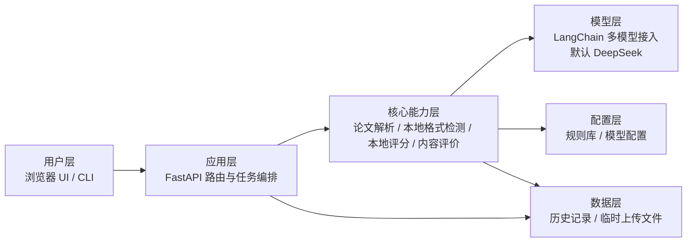
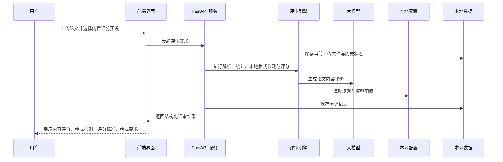

# Thesisev

轻量论文评审工具。

## 设计理念

- 格式检测与格式评价由本地程序完成（按规则合规率扣分，非单段抽样）
- 内容评分项默认由大模型打分，未配置 API Key 时回退到本地规则
- 内容评价由大模型生成，未配置 API Key 时使用本地模板
- 评分标准与格式要求均来自程序内置 `json` 文件，评分项以稳定 `key` 关联代码，不依赖中文标签

## 主要功能

- 论文结构解析：支持上传 `md` 或 `docx` 论文，解析标题、章节、段落与句子结构。
- 本地格式检测与评分：正文/标题等规则按段落全局合规率判定并扣分；`docx` 快照含页面设置、表格与段落 run 属性，无法判定的规则明确标注「需人工核对」而不是静默通过或全扣。
- 大模型内容评价：基于 LangChain 接入多种大模型，默认使用 `deepseek/deepseek-chat` 生成论文内容评价，LLM 负责内容评价与评分；调用带指数退避重试，单评分项 LLM 失败时自动降级为本地规则，不中断整次评审。
- 本地逻辑审查：确定性检测跨章节证据链与数据一致性（如「结论」章节无实验/测试/结果章节支撑、同一指标在不同章节数值冲突），以「逻辑问题」类别呈现在问题清单中供人工复核，不参与自动扣分。
- 本地语气检测：口语化词典（我觉得/其实/然后/挺/特别等）带上下文消歧规则，抑制「其实质/其实际」「特别是」「然后进行」等正式搭配的误报。
- 预设规则读取：评分标准与格式要求均从程序内置 `json` 文件读取，UI 提供评分预设下拉菜单，选择后自动加载对应的评分标准与格式要求。
- 历史记录：自动保存最近评审记录（写入带线程锁与原子替换）；上传文件仅用于本次评审。
- 异步评审：`/evaluate/upload` 提交后立即返回 `job_id`，解析与 LLM 评审在有界线程池后台执行，前端轮询任务状态，避免并发评审阻塞事件循环。
- 多入口使用：同时提供 CLI、FastAPI API 和内置 Web UI，便于命令行调用、接口集成和页面操作。
- 可回归性：`tests/` 固化评分分发、rubric key、格式合规率阈值、LLM 降级/钳制与任务化评审等行为。

## 快速开始

安装依赖：

```bash
uv sync
```

命令行评审：

```bash
uv run thesisev examples/sample_thesis.md
uv run thesisev examples/sample_thesis.md --preset report_iot
```

启动 Web UI：

```bash
./scripts/start_api.sh
open http://127.0.0.1:8000
```

## CLI

只接受 `md` 或 `docx` 文件输入：

```bash
uv run thesisev examples/sample_thesis.md
uv run thesisev examples/sample_thesis.md --output structure
uv run thesisev examples/sample_thesis.md --preset report_iot
uv run thesisev examples/sample_thesis.md --preset report_iot --json
```

其中 `--preset` 用于选择程序内置评分预设，当前支持 `thesis_tech` 和 `report_iot`。

## API / UI

```bash
./scripts/start_api.sh
open http://127.0.0.1:8000
```

评分预设由程序内置，当前 UI 可选择的预设例如 `thesis_tech` 和 `report_iot`。对应的评分标准与格式要求会自动加载，无需上传。`report_iot` 会同时读取 `score_report_iot.json` 和 `score_report_iot_f.json`。

内置格式规则采用结构化 `json`，每条规则在 `check` 中声明 `type`、`expected` 和必要参数，便于本地解析与人工复核。

## 评分逻辑

- 格式检测与格式评价由本地程序完成，包括问题清单、格式要求读取和规则化评分明细；格式分数计入总分（`raw_total` 为内容项与格式项满分之和，理工科默认 75，调研报告默认 100）。
- 内容评价由 LLM 生成，当前实现位于 `thesisev/commentary.py`；未配置 API Key 时使用本地内容评价模板回退。
- 内容评分项默认由 LLM 生成（每项一次调用），当前实现位于 `thesisev/scoring.py` 的 `calculate_score_report()`；未配置 API Key 或单次调用失败时回退到本地规则。
- 返回结果中：
  - `score` 表示最终分数
  - `metadata.score_detail` 表示各项规则化评分明细（`criteria` 列表，含稳定 `key`、分数、证据、扣分与建议）
  - `metadata.score_source` 为 `llm` 或 `local`
  - `metadata.comment_source` 为 `llm` 或 `fallback`
  - `metadata.evaluation_roles` 表示格式检测、格式评价和内容评价分别由谁完成

## 评价标准

### 毕业设计

- 理工科（默认 `thesis_tech`）：
  - 内容：`config/score_thesis_tech.json`（6 项）
  - 格式：`config/score_thesis_tech_f.json`（计入总分，满分 15）

### 调研报告

- 物联网（`report_iot`）：
  - 内容：`config/score_report_iot.json`
  - 格式：`config/score_report_iot_f.json`

## 毕业设计评分实现方案

- `analyzers.py` 继续负责提取结构、关键词、问题、主题相关度等信号
- `scoring.py` 负责评分编排、LLM 调用、rubric key 分发、格式项追加、结果汇总与本地可评分性自检。
- `scoring_content.py` 负责毕业设计六项内容评分的本地规则。
- `scoring_format.py` 负责格式规范读取、DOCX 全局合规率判定与格式扣分（thesis 与 iot 共用同一引擎）。
- `rubric_utils.py` 负责 rubric 解析、稳定 `key` 推断/合并与分数钳制。
- `scoring_iot.py` 负责物联网调研报告 `report_iot` 的本地评分规则，避免专用规则继续堆在通用评分模块中。

输出结构建议：

```json
{
  "score": 74,
  "raw_score": 48.0,
  "raw_total": 75.0,
  "score_source": "llm",
  "criteria": [
    {
      "key": "topic_workload",
      "name": "选题及工作量",
      "score": 15.5,
      "max_score": 20,
      "evidence": ["章节数 5", "篇幅 8200", "主题相关占比 72.4%"],
      "deductions": ["章节分布略不均衡"],
      "suggestions": ["补充需求分析或实验验证内容"]
    }
  ]
}
```

内容评分项（6 项，默认 LLM 打分、本地规则兜底）的规则化实现：

- [x] `score_topic_workload(document, topic_analysis, technology_details)`：根据内容规模、章节完整度、主题聚焦度和技术覆盖给分。
- [x] `score_research_argument(document, keywords)`：检测参考文献、引用数量、文献与主题关键词的相关性，以及“因此/表明/综上”等论证表达。
- [x] `score_translation(document)`：检测是否同时存在中英文摘要，判断英文摘要长度、句子完整性和英文摘要篇幅。
- [x] `score_experiment_analysis(document, technology_details)`：判断是否包含方案、数据处理、分析论证、可行性或效益分析等要素。
- [x] `score_writing_quality(document, writing_issues)`：仅根据本地识别出的书面表达问题扣分；格式问题由独立格式评分链路处理。
- [x] `score_innovation(document, technology_details)`：检测“创新/改进/优化/提出/应用价值”等表述，并结合结论章节和技术组合给启发式评分。

格式评分项（`key = "format"`）由本地程序按结构化规则扣分，理工科与调研报告分别使用 `config/score_thesis_tech_f.json` 与 `config/score_report_iot_f.json`。

总分计算：

```python
raw_score = sum(item.score for item in criteria)
raw_total = sum(item.max_score for item in criteria)  # 含格式项：理工科 75，调研报告 100
score = round(raw_score / raw_total * 100)
```

## 输出示例

CLI 文本输出示例：

```text
Title: 基于 LangChain 的论文评价助手设计与实现
Type: md
Score: 74

Statistics:
- 篇幅: 213
- 章节数: 3

Content Evaluation:
论文围绕 LangChain、论文评价助手设计等内容展开，章节安排较为均衡，
主题关联内容占比基本合理，技术方案已有一定体现。
```

API JSON 输出示例：

```json
{
  "ok": true,
  "mode": "evaluate_upload",
  "data": {
    "score": 74,
    "comment": "论文围绕 LangChain、论文评价助手设计等内容展开……",
    "statistics": [
      {"label": "篇幅", "value": "213"},
      {"label": "章节数", "value": "3"}
    ],
    "metadata": {
      "score_source": "llm",
      "score_detail": {
        "raw_score": 48.0,
        "raw_total": 75.0,
        "rubric_source": "score_thesis_tech.json",
        "score_source": "llm",
        "criteria": [
          {
            "key": "topic_workload",
            "name": "选题及工作量",
            "score": 15.5,
            "max_score": 20,
            "evaluation": "llm"
          },
          {
            "key": "format",
            "name": "格式规范",
            "score": 12.0,
            "max_score": 15,
            "evaluation": "local_program"
          }
        ]
      },
      "comment_source": "llm",
      "evaluation_roles": {
        "format_detection": "local",
        "format_evaluation": "local",
        "content_evaluation": "llm"
      },
      "model": {
        "provider": "deepseek",
        "model": "deepseek-chat"
      },
      "rubric": {
        "total_score": 75.0
      },
      "format_requirements": {
        "item_count": 3
      }
    }
  }
}
```

## 接口

```bash
curl http://127.0.0.1:8000/health
curl http://127.0.0.1:8000/history
```

### 异步评审任务

`POST /evaluate/upload` 不再同步阻塞：上传文件后立即返回 `job_id`，解析与 LLM 评审在后台有界线程池（默认 2 个 worker）中执行，避免并发请求互相排队阻塞事件循环。

```bash
# 1. 提交任务，得到 job_id
curl -F "file=@examples/sample_thesis.md" -F "preset=thesis_tech" \
  http://127.0.0.1:8000/evaluate/upload
# => {"ok":true,"mode":"evaluate_upload","data":{"job_id":"...","status":"queued"}}

# 2. 轮询任务状态；done 时 data.result 携带完整评审结果
curl http://127.0.0.1:8000/evaluate/jobs/{job_id}
# => {"ok":true,"mode":"evaluate_upload",
#     "data":{"job_id":"...","status":"done","error":null,"result":{...}}}
```

任务状态为 `queued` / `running` / `done` / `error`。任务记录保存在进程内存中（上限 20 条，超出时优先淘汰已结束任务），服务重启后需重新提交。

## 说明

- 默认模型：`deepseek/deepseek-chat`
- 未配置 API Key 时，内容评价自动回退到本地模板，内容评分项回退到本地规则
- 格式检测与格式评价由本地程序完成，LLM 只负责内容评价与内容项评分
- 返回结果中可通过 `metadata.score_source`、`metadata.comment_source` 和 `metadata.evaluation_roles` 判断职责来源
- 最近评审会写入本地 `data/history.json`
- 现在只支持上传 `md` 或 `docx` 文件评审
- 每次通过 Web UI 或 `/evaluate/upload` 评审都必须显式上传论文文件；系统不会复用、展示或缓存全局最近上传内容
- Web UI 展示上传文档、问题项和 LLM 评价时使用 `textContent` / DOM 节点构造；`innerHTML` 仅用于清空容器
- `examples/sample_thesis.md` 提供可直接运行的样例文档

## 目录说明

- `config/`：静态配置文件，包括规则库、关键词库和 `provider_env.toml`
- `data/`：运行时数据，包括历史记录和上传过程中的临时文件
- `examples/`：可直接运行的样例论文（`sample_thesis.md`）
- `static/`：前端静态资源，包括样式和交互脚本
- `templates/`：FastAPI 内置 UI 的 HTML 模板
- `tests/`：回归测试（rubric key、格式合规率、评分分发与总分一致性）
- `thesisev/`：核心 Python 包，包括解析、分析、本地评分、内容评价生成、CLI 和 API
- `scripts/`：项目启动脚本

## 架构图

### 工程结构



### 运行流程


