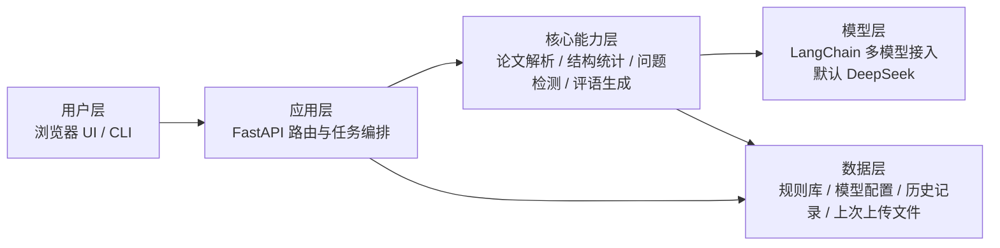
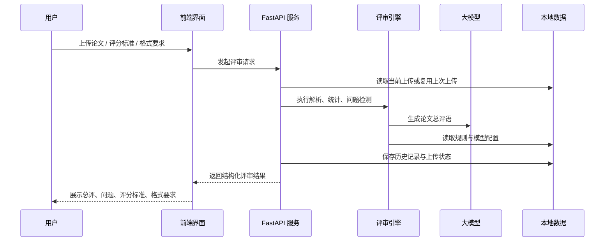

# Thesisev

轻量论文评审工具。

## 快速开始

安装依赖：

```bash
uv sync
```

命令行评审：

```bash
uv run thesisev examples/sample_thesis.md
```

启动 Web UI：

```bash
./scripts/start_api.sh
open http://127.0.0.1:8000
```

## 主要功能

- 论文结构解析：支持上传 `md` 或 `docx` 论文，解析标题、章节、段落与句子结构。
- 基础质量评审：自动统计章节占比、主题相关度、关键词和技术栈，并识别标点误用、口语化表达等问题。
- 大模型评语生成：基于 LangChain 接入多种大模型，默认使用 `deepseek/deepseek-chat` 生成论文总评语。
- 评分标准读取：支持上传评分标准 `json` 文件，解析后在 UI 中展示，并随评审结果一起返回。
- 格式要求读取：支持上传格式要求 `json` 文件，解析后在 UI 中展示，并随评审结果一起返回。
- 历史与复用：自动保存最近评审记录，并记住上次上传的论文、评分标准、格式要求，刷新页面后可直接复用。
- 多入口使用：同时提供 CLI、FastAPI API 和内置 Web UI，便于命令行调用、接口集成和页面操作。

## CLI

只接受 `md` 或 `docx` 文件输入：

```bash
uv run thesisev examples/sample_thesis.md
uv run thesisev examples/sample_thesis.md --output structure
```

## API / UI

```bash
./scripts/start_api.sh
open http://127.0.0.1:8000
```

UI 可选上传评分标准 `json` 文件，支持这两种格式：

```json
{"摘要": 10, "结构": 20, "结论": 10}
```

```json
[{"摘要": 10}, {"结构": 20}, {"结论": 10}]
```

UI 也可选上传格式要求 `json` 文件，支持对象或数组，例如：

```json
{"页边距": "上2.5cm，下2.5cm", "标题层级": "最多三级", "参考文献": "GB/T 7714"}
```

```json
["正文使用小四宋体", "摘要不超过 300 字", {"行距": "1.5 倍"}]
```

## 输出示例

CLI 文本输出示例：

```text
Title: 基于 LangChain 的论文评价助手设计与实现
Type: md
Score: 74

Statistics:
- 总字数: 213
- 章节数: 3

Comment:
论文围绕 LangChain、论文评价助手设计等内容展开，章节安排较为均衡，
整体质量较为基础，仍需进一步提升主题聚焦度与学术表达规范性。
```

API JSON 输出示例：

```json
{
  "ok": true,
  "mode": "evaluate_upload",
  "data": {
    "score": 74,
    "comment": "论文围绕 LangChain、论文评价助手设计等内容展开……",
    "statistics": [
      {"label": "总字数", "value": "213"},
      {"label": "章节数", "value": "3"}
    ],
    "metadata": {
      "model": {
        "provider": "deepseek",
        "model": "deepseek-chat"
      },
      "rubric": {
        "total_score": 40.0
      },
      "format_requirements": {
        "item_count": 3
      }
    }
  }
}
```

## 接口

```bash
curl http://127.0.0.1:8000/health
curl http://127.0.0.1:8000/history
curl http://127.0.0.1:8000/last-upload
```

## 说明

- 默认模型：`deepseek/deepseek-chat`
- 未配置 API Key 时自动回退到规则评语
- 最近评审会写入本地 `data/history.json`
- 现在只支持上传 `md` 或 `docx` 文件评审
- 上传过一次后，页面刷新或再次评审时会自动复用上次上传的论文、评分标准、格式要求

## 架构图

### 工程结构



### 运行流程


