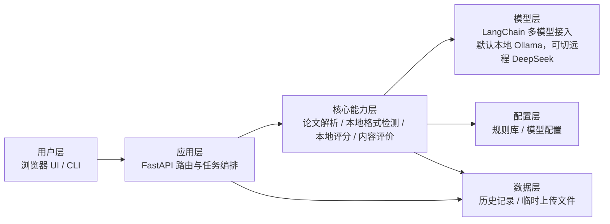
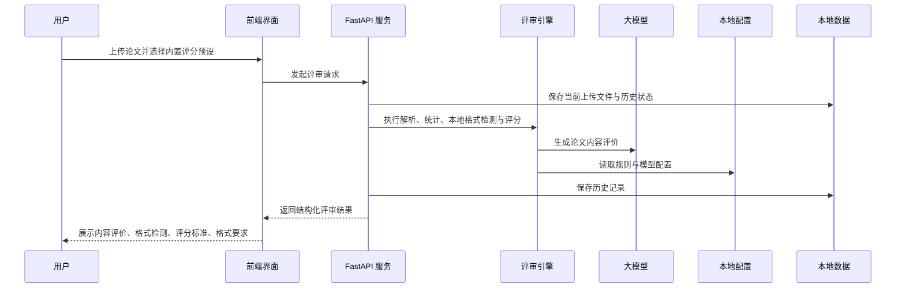

# Thesisev

轻量论文评审工具。

## 设计理念

- 格式检测与格式评价由本地程序完成（按规则合规率扣分，非单段抽样）
- 内容评分项默认由大模型打分，模型不可用时回退到本地规则
- 内容评价由大模型生成，模型不可用时使用本地模板
- 推理引擎分本地与远程两档，默认本地：论文不出本机，且评分模型钉在固定权重版本上，同一篇稿件的分数长期可比
- 评分标准与格式要求均来自程序内置 `json` 文件，评分项以稳定 `key` 关联代码，不依赖中文标签
- 分析词表（技术栈别名、通用术语、短语与动作词）内联在 `thesisev/terms.py`，属于算法启发式而非评分规则，不占用配置文件

## 主要功能

- 论文结构解析：支持上传 `md` 或 `docx` 论文，解析标题、章节、段落与句子结构。
- 本地格式检测与评分：正文/标题等规则按段落全局合规率判定并扣分；`docx` 快照含页面设置、表格与段落 run 属性，无法判定的规则明确标注「需人工核对」而不是静默通过或全扣。
- 大模型内容评价：基于 LangChain 接入多种大模型，默认走本地 Ollama（`ollama/qwen3:8b`）生成论文内容评价，LLM 负责内容评价与评分；调用带指数退避重试，单评分项 LLM 失败时自动降级为本地规则，不中断整次评审。显式切换 `--engine remote` 后改用 `deepseek/deepseek-flash`。
- 本地逻辑审查：确定性检测跨章节证据链与数据一致性（如「结论」章节无实验/测试/结果章节支撑、同一指标在不同章节数值冲突），以「逻辑问题」类别呈现在问题清单中供人工复核，不参与自动扣分。
- 本地语气检测：口语化词典（我觉得/其实/然后/挺/特别等）带上下文消歧规则，抑制「其实质/其实际」「特别是」「然后进行」等正式搭配的误报。
- 深度复核（可选）：配置可用引擎后对逻辑与语气做一次有界 LLM 复核（跨章节证据链、数据矛盾、词典无法判定的措辞），结构化输出并只追加与本地结果不重复的条目；引擎不可用、调用失败或解析失败时静默降级为纯本地检测，行为与不启用时完全一致。
- 预设规则读取：评分标准与格式要求均从程序内置 `json` 文件读取，UI 提供评分预设下拉菜单，选择后自动加载对应的评分标准与格式要求。
- 历史记录：自动保存最近评审记录（写入带线程锁与原子替换）；上传文件仅用于本次评审。
- 异步评审：`/evaluate/upload` 提交后立即返回 `job_id`，解析与 LLM 评审在有界线程池后台执行，前端轮询任务状态，避免并发评审阻塞事件循环。
- 多入口使用：同时提供 CLI、FastAPI API 和内置 Web UI，便于命令行调用、接口集成和页面操作。
- 可回归性：本地 `tests/` 固化评分分发、rubric key、格式合规率阈值、LLM 降级/钳制与任务化评审等行为（该目录不进版本库，详见「目录说明」）。

## 快速开始

安装依赖：

```bash
uv sync
```

默认走本地引擎，需先准备好本机推理服务（只做一次）：

```bash
OLLAMA_CONTEXT_LENGTH=16384 ollama serve   # 另开一个终端保持运行
ollama pull qwen3:8b
```

命令行评审：

```bash
uv run thesisev examples/sample_thesis.md
uv run thesisev examples/sample_thesis.md --json
```

改用远程引擎（需先配置 `DEEPSEEK_API_KEY`）：

```bash
uv run thesisev examples/sample_thesis.md --engine remote
```

启动 Web UI：

```bash
./scripts/start_api.sh
open http://127.0.0.1:8000
```

## 开发与质量检查

```bash
uv sync --group dev        # 安装 ruff / ty / pytest 等开发依赖

uv run ruff check thesisev tests      # lint
uv run ruff format thesisev tests     # 格式化
uv run ty check                       # 类型检查（[tool.ty] rules.all = "error"，最严级别）
uv run pytest tests -q                # 回归测试

# 或一键执行以上全部检查：
./scripts/check_all.sh
```

`tests/` 不进版本库，仅存在于开发机，因此全新 clone 上 `check_all.sh` 会自动跳过测试步骤并打印提示，其余检查照常执行。

## CLI

只接受 `md` 或 `docx` 文件输入：

```bash
uv run thesisev examples/sample_thesis.md
uv run thesisev examples/sample_thesis.md --output structure
uv run thesisev examples/sample_thesis.md --preset thesis_tech
uv run thesisev examples/sample_thesis.md --preset thesis_tech --json
```

其中 `--preset` 用于选择程序内置评分预设，当前仅提供 `thesis_tech`。

推理引擎用 `--engine` 选择，默认 `local`：

| 参数 | 默认值 | 说明 |
|---|---|---|
| `--engine` | `local` | `local` 走本机 Ollama，论文不出本机；`remote` 走 DeepSeek API |
| `--provider` | 跟随引擎 | 显式指定模型提供方，优先级高于 `--engine`（引擎由提供方推导，故 `--provider deepseek` 与 `--engine remote` 等价） |
| `--model` | 跟随提供方 | 显式模型名。`local` 默认 `qwen3:8b`，`remote` 默认 `deepseek-flash` |
| `--max-tokens` | 跟随提供方 | 输出上限。`local` 默认 `1024`，`remote` 默认 `400` |

```bash
uv run thesisev examples/sample_thesis.md --engine remote --model deepseek-v4-pro
uv run thesisev examples/sample_thesis.md --provider ollama --model qwen3:14b
```

`--engine local` 会在评审前探测本机推理服务：服务未启动或所选模型未拉取时，直接走本地规则并在 stderr 给出原因，不会为每次调用白等退避重试。

## API / UI

```bash
./scripts/start_api.sh
open http://127.0.0.1:8000
```

评分预设由程序内置，当前 UI 仅提供 `thesis_tech`，对应的评分标准（`config/score_thesis_tech.json`）与格式要求（`config/score_thesis_tech_f.json`）会自动加载，无需上传。

内置格式规则采用结构化 `json`，每条规则在 `check` 中声明 `type`、`expected` 和必要参数，便于本地解析与人工复核。

## 评分逻辑

- 格式检测与格式评价由本地程序完成，包括问题清单、格式要求读取和规则化评分明细；格式分数计入总分（`raw_total` 为内容项与格式项满分之和，默认 75）。
- 内容评价由 LLM 生成，当前实现位于 `thesisev/commentary.py`；引擎不可用时使用本地内容评价模板回退。
- 内容评分项默认由 LLM 生成（每项一次调用），当前实现位于 `thesisev/scoring.py` 的 `calculate_score_report()`；引擎不可用或单次调用失败时回退到本地规则。
- 返回结果中：
  - `score` 表示最终分数
  - `metadata.score_detail` 表示各项规则化评分明细（`criteria` 列表，含稳定 `key`、分数、证据、扣分与建议）
  - `metadata.score_source` 为 `llm` 或 `local`
  - `metadata.comment_source` 为 `llm` 或 `fallback`
  - `metadata.evaluation_roles` 表示格式检测、格式评价、内容评价与逻辑深度复核分别由谁完成
  - `metadata.deep_review.added_count` 表示本次深度复核实际追加的逻辑/语气问题数（未启用时为 `skipped`）

## 评价标准

- 理工科（默认 `thesis_tech`）：
  - 内容：`config/score_thesis_tech.json`（6 项）
  - 格式：`config/score_thesis_tech_f.json`（计入总分，满分 15）

## 毕业设计评分实现方案

- `analyzers.py` 继续负责提取结构、关键词、问题、主题相关度等信号
- `scoring.py` 负责评分编排、LLM 调用、rubric key 分发、格式项追加、结果汇总与本地可评分性自检。
- `scoring_content.py` 负责毕业设计六项内容评分的本地规则。
- `scoring_format.py` 负责格式规范读取、DOCX 全局合规率判定与格式扣分。
- `rubric_utils.py` 负责 rubric 解析、稳定 `key` 推断/合并与分数钳制。
- `terms.py` 负责内联的分析词表（技术栈别名、通用术语、短语与动作词）。

输出结构建议：

```json
{
  "score": 74,
  "raw_score": 48.0,
  "raw_total": 75.0,
  "score_source": "llm",
  "criteria": [
    {
      "key": "topic_workload",
      "name": "选题及工作量",
      "score": 15.5,
      "max_score": 20,
      "evidence": ["章节数 5", "篇幅 8200", "主题相关占比 72.4%"],
      "deductions": ["章节分布略不均衡"],
      "suggestions": ["补充需求分析或实验验证内容"]
    }
  ]
}
```

内容评分项（6 项，默认 LLM 打分、本地规则兜底）的规则化实现：

- [x] `score_topic_workload(document, topic_analysis, technology_details)`：根据内容规模、章节完整度、主题聚焦度和技术覆盖给分。
- [x] `score_research_argument(document, keywords)`：检测参考文献、引用数量、文献与主题关键词的相关性，以及“因此/表明/综上”等论证表达。
- [x] `score_translation(document)`：检测是否同时存在中英文摘要，判断英文摘要长度、句子完整性和英文摘要篇幅。
- [x] `score_experiment_analysis(document, technology_details)`：判断是否包含方案、数据处理、分析论证、可行性或效益分析等要素。
- [x] `score_writing_quality(document, writing_issues)`：仅根据本地识别出的书面表达问题扣分；格式问题由独立格式评分链路处理。
- [x] `score_innovation(document, technology_details)`：检测“创新/改进/优化/提出/应用价值”等表述，并结合结论章节和技术组合给启发式评分。

格式评分项（`key = "format"`）由本地程序按结构化规则扣分，规则来自 `config/score_thesis_tech_f.json`。

总分计算：

```python
raw_score = sum(item.score for item in criteria)
raw_total = sum(item.max_score for item in criteria)  # 含格式项：默认 75
score = round(raw_score / raw_total * 100)
```

## 输出示例

CLI 文本输出示例：

```text
Title: 基于 LangChain 的论文评价助手设计与实现
Type: md
Score: 74

Statistics:
- 篇幅: 213
- 章节数: 3

Content Evaluation:
论文围绕 LangChain、论文评价助手设计等内容展开，章节安排较为均衡，
主题关联内容占比基本合理，技术方案已有一定体现。
```

API JSON 输出示例：

```json
{
  "ok": true,
  "mode": "evaluate_upload",
  "data": {
    "score": 74,
    "comment": "论文围绕 LangChain、论文评价助手设计等内容展开……",
    "statistics": [
      {"label": "篇幅", "value": "213"},
      {"label": "章节数", "value": "3"}
    ],
    "metadata": {
      "score_source": "llm",
      "score_detail": {
        "raw_score": 48.0,
        "raw_total": 75.0,
        "rubric_source": "score_thesis_tech.json",
        "score_source": "llm",
        "criteria": [
          {
            "key": "topic_workload",
            "name": "选题及工作量",
            "score": 15.5,
            "max_score": 20,
            "evaluation": "llm"
          },
          {
            "key": "format",
            "name": "格式规范",
            "score": 12.0,
            "max_score": 15,
            "evaluation": "local_program"
          }
        ]
      },
      "comment_source": "llm",
      "evaluation_roles": {
        "format_detection": "local",
        "format_evaluation": "local",
        "content_evaluation": "llm"
      },
      "model": {
        "engine": "local",
        "provider": "ollama",
        "model": "qwen3:8b",
        "available": true,
        "availability": "credential_not_required"
      },
      "rubric": {
        "total_score": 75.0
      },
      "format_requirements": {
        "item_count": 3
      }
    }
  }
}
```

## 接口

```bash
curl http://127.0.0.1:8000/health
curl http://127.0.0.1:8000/history
```

### 异步评审任务

`POST /evaluate/upload` 不再同步阻塞：上传文件后立即返回 `job_id`，解析与 LLM 评审在后台有界线程池（默认 2 个 worker）中执行，避免并发请求互相排队阻塞事件循环。

```bash
# 1. 提交任务，得到 job_id
curl -F "file=@examples/sample_thesis.md" -F "preset=thesis_tech" \
  http://127.0.0.1:8000/evaluate/upload
# => {"ok":true,"mode":"evaluate_upload","data":{"job_id":"...","status":"queued"}}

# 2. 轮询任务状态；done 时 data.result 携带完整评审结果
curl http://127.0.0.1:8000/evaluate/jobs/{job_id}
# => {"ok":true,"mode":"evaluate_upload",
#     "data":{"job_id":"...","status":"done","error":null,"result":{...}}}
```

任务状态为 `queued` / `running` / `done` / `error`。任务记录保存在进程内存中（上限 20 条，超出时优先淘汰已结束任务），服务重启后需重新提交。

## 说明

### 双档引擎

引擎由模型提供方推导（见 `thesisev/llm.py` 的 `ENGINE_PROVIDERS`），两档共用同一条 LangChain 调用路径，切换只改变端点与请求体，不新增依赖。

| | `local`（默认） | `remote` |
|---|---|---|
| 提供方 / 模型 | `ollama` / `qwen3:8b` | `deepseek` / `deepseek-flash` |
| 凭据 | 不需要 | `DEEPSEEK_API_KEY` |
| 端点 | `http://127.0.0.1:11434/v1` | `https://api.deepseek.com` |
| 论文去向 | 不出本机 | 上传至第三方 |
| 输出上限 | 1024 token | 400 token |
| 分数可复现性 | 权重版本固定，长期可比 | 模型别名可被静默改指 |

切换方式：CLI 用 `--engine remote`，API / Web UI 用 `engine` 字段，表单默认选中 `local`。

### 本地引擎的运行前置

- 需先启动 Ollama 并拉取所选模型。评审前会探测 `/v1/models`：服务未启动或模型未拉取时，`metadata.model.availability` 记为 `runtime_unreachable`，`available` 为 `false`，整条链路立即降级为本地规则，不消耗退避重试。
- **上下文窗口必须在服务端设置**。Ollama 的 OpenAI 兼容接口在解码时会丢弃请求体里的 `num_ctx`，因此无法按请求调整；而本机显存档位（< 24 GiB）对应的默认窗口偏小，prompt 超出时 Ollama 会**静默丢弃开头部分**（连同系统提示）。启动前设 `OLLAMA_CONTEXT_LENGTH=16384`。
- Qwen3 在 Ollama 中默认开启 thinking，本项目通过 `reasoning_effort = none` 显式关闭，否则推理内容会吃光 token 预算并返回空 `content`。

### 远程引擎

- DeepSeek 现行模型 ID 为 `deepseek-flash` 与 `deepseek-v4-pro`，旧的 `deepseek-chat` / `deepseek-reasoner` 别名已于 2026-07-24 停用。
- 配置 API Key：优先设置环境变量 `DEEPSEEK_API_KEY`；也可在 `config/provider_env.toml` 的 `api_key` 字段填入字面值（该文件在版本库跟踪范围内，不推荐）。两者都取不到时按未配置处理。
- DeepSeek 默认开启 thinking 模式，本项目在请求中显式关闭（`thinking.type = disabled`），以保证评分项返回严格 JSON。

### 其他

- 引擎不可用时，内容评价自动回退到本地模板，内容评分项回退到本地规则
- 模型配置元数据（`metadata.model`）记录 `engine`、`provider`、`model`、`credential_source`、`available` 与 `availability`，不写入密钥本身；落盘前另有 `FORBIDDEN_METADATA_KEYS` 过滤兜底
- 格式检测与格式评价由本地程序完成，LLM 只负责内容评价与内容项评分
- 返回结果中可通过 `metadata.score_source`、`metadata.comment_source` 和 `metadata.evaluation_roles` 判断职责来源
- 最近评审会写入本地 `data/history.json`
- 现在只支持上传 `md` 或 `docx` 文件评审
- 每次通过 Web UI 或 `/evaluate/upload` 评审都必须显式上传论文文件；系统不会复用、展示或缓存全局最近上传内容
- Web UI 展示上传文档、问题项和 LLM 评价时使用 `textContent` / DOM 节点构造；`innerHTML` 仅用于清空容器
- `examples/sample_thesis.md` 提供可直接运行的样例文档

## 目录说明

- `config/`：静态配置文件，包括评分标准与格式要求（`score_*.json`）、文本词典（`colloquial.json`、`stopwords.json`、`punctuation_*.json`）和 `provider_env.toml`
- `data/`：运行时数据，包括历史记录和上传过程中的临时文件
- `examples/`：可直接运行的样例论文（`sample_thesis.md`）；与 `tests/` 一样被 `.gitignore` 忽略，仅存在于开发机
- `static/`：前端静态资源，包括样式和交互脚本
- `templates/`：FastAPI 内置 UI 的 HTML 模板
- `tests/`：本地回归测试（rubric key、格式合规率、评分分发与总分一致性）；被 `.gitignore` 忽略，不进版本库
- `thesisev/`：核心 Python 包，包括解析、分析、本地评分、内容评价生成、CLI 和 API
- `scripts/`：项目启动与质量检查脚本

## 架构图

### 工程结构


```mermaid
flowchart LR
    U["用户层<br/>浏览器 UI / CLI"]
    A["应用层<br/>FastAPI 路由与任务编排"]
    C["核心能力层<br/>论文解析 / 本地格式检测 / 本地评分 / 内容评价"]
    M["模型层<br/>LangChain 多模型接入<br/>默认本地 Ollama，可切远程 DeepSeek"]
    CFG["配置层<br/>规则库 / 模型配置"]
    D["数据层<br/>历史记录 / 临时上传文件"]

    U --> A
    A --> C
    C --> M
    C --> CFG
    C --> D
    A --> D
```

### 运行流程


```mermaid
sequenceDiagram
    participant User as 用户
    participant UI as 前端界面
    participant API as FastAPI 服务
    participant Core as 评审引擎
    participant LLM as 大模型
    participant Config as 本地配置
    participant Data as 本地数据

    User->>UI: 上传论文并选择内置评分预设
    UI->>API: 发起评审请求
    API->>Data: 保存当前上传文件与历史状态
    API->>Core: 执行解析、统计、本地格式检测与评分
    Core->>LLM: 生成论文内容评价
    Core->>Config: 读取规则与模型配置
    API->>Data: 保存历史记录
    API-->>UI: 返回结构化评审结果
    UI-->>User: 展示内容评价、格式检测、评分标准、格式要求
```
